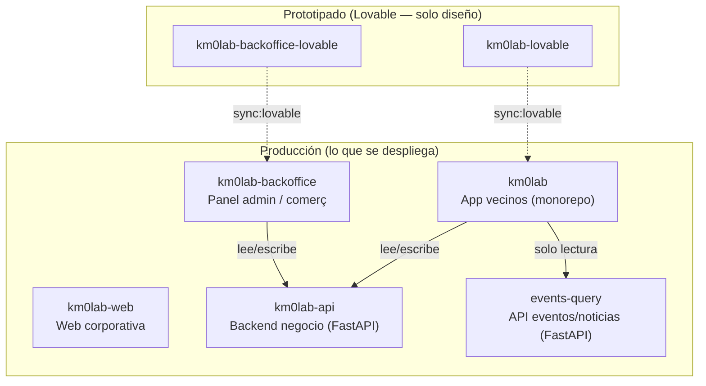
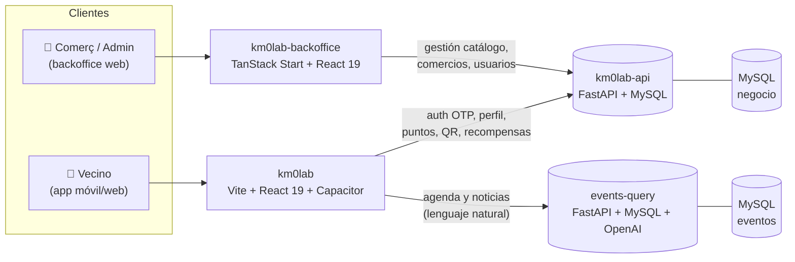
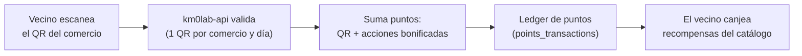

# KM0 LAB — Documentación global del proyecto

> **Para quién es este documento.** Para cualquier persona —técnica o no— que
> se acerca a KM0 LAB por primera vez y quiere entender el proyecto entero: qué
> es, qué piezas lo forman, cómo encajan y cómo se trabaja en él. Es la vista
> "de pájaro" de todo el ecosistema. Cada repositorio tiene además su propia
> documentación de detalle; aquí se enlaza cuándo bajar a ese nivel.
>
> **Estado:** vivo · **Idioma del proyecto:** contenido en català (por defecto),
> es, en · código e identificadores en inglés.

---

## 1. Qué es KM0 LAB

**KM0 LAB es la app del comercio y la vida de proximidad de un municipio.**
Piloto: **Malgrat de Mar** (con Blanes y Lloret de Mar como poblaciones
adicionales del modelo). Su propósito es conectar a los vecinos con:

- **El comercio local** — fichas de comercios, promociones y un programa de
  fidelización por puntos.
- **La agenda del municipio** — eventos, actividades y noticias, buscables en
  lenguaje natural.
- **Un asistente con IA** — chat que responde "¿qué hago este fin de semana?"
  con eventos reales cercanos.

El corazón del producto es la **gamificación**: el vecino escanea el **QR
físico** de un comercio, gana **puntos**, y los canjea por **recompensas**
(vales, descuentos, entradas, experiencias). Los comercios y el ayuntamiento
gestionan todo esto desde un **backoffice** web.

**Características transversales del producto:**

| Rasgo | Detalle |
| --- | --- |
| Plataforma | Uso mayoritariamente **móvil, en vertical (portrait)**. Corre en **web** (Vercel) y como **app móvil** (iOS/Android vía Capacitor). |
| Idiomas | **Trilingüe**: català (por defecto), castellano, inglés. |
| Ámbito | Multi-municipio por diseño: cada **població** tiene 1 administrador y N comercios. |
| Fidelización | Puntos por escaneo de QR + acciones bonificadas → catálogo de recompensas canjeables. |

---

## 2. El ecosistema: siete repositorios

KM0 LAB **no es un único repositorio**, sino un ecosistema de siete. Entenderlo
es la clave para no perderse. Se agrupan en cuatro familias.



| Repositorio | Familia | Rol | Rama de trabajo |
| --- | --- | --- | --- |
| **`km0lab`** | App (prod) | Monorepo de la **app de vecinos** + **fuente de verdad de la documentación de proceso**. | `develop` |
| **`km0lab-lovable`** | App (proto) | Prototipo visual de la app en **Lovable**. Source of truth de pantallas/diseño/assets. | `main` |
| **`km0lab-backoffice`** | Backoffice (prod) | Panel web para **administradores** (gestor de població) y **comerços**. | `develop` |
| **`km0lab-backoffice-lovable`** | Backoffice (proto) | Prototipo visual del backoffice en **Lovable**. | `main` |
| **`km0lab-api`** | Backend | **Backend de negocio**: usuarios, auth, puntos, comercios, QR, recompensas. FastAPI + MySQL. | `develop` |
| **`events-query`** | Backend | **API de eventos y noticias** del municipio con búsqueda en lenguaje natural (IA). Solo lectura. | `develop` |
| **`km0lab-web`** | Web | **Web corporativa** de KM0 LAB (landing, contacto). | `main` |

> **Nota sobre los "-lovable".** No son proyectos independientes: son el
> entorno donde se **diseña** la interfaz antes de llevarla a producción. Ver
> §4 (el flujo Lovable ↔ producción). El backoffice **no** vive dentro del
> monorepo `km0lab`: es un repositorio propio, `km0lab-backoffice` (stack
> distinto).

---

## 3. Arquitectura técnica de un vistazo

Dos frontends de producto (app de vecinos y backoffice), una web corporativa y
dos backends especializados.



**Principio de diseño: dos backends, dos dominios.** Se mantienen separados a
propósito porque tienen ciclos de vida y responsabilidades distintas:

- **`events-query`** es un servicio especializado de **scraping + búsqueda
  semántica** de la agenda del municipio. La app solo lo **consume** (lectura).
- **`km0lab-api`** es el dominio de **negocio y la sesión del usuario**
  (identidad, puntos, comercios, QR, recompensas). Lectura y escritura.

Los **textos e idiomas (i18n)** no viven en ningún backend: viven en el código
de cada frontend. El backend solo persiste **datos**.

### Stacks por repositorio

| Repo | Lenguaje / framework | UI | Datos / estado | Paquetes |
| --- | --- | --- | --- | --- |
| `km0lab` (app) | Vite + **React 19** + TypeScript ~5.9 + **Capacitor** | Tailwind v3 + shadcn/ui + Radix + Framer Motion | React Query · Zustand · XState · RHF + Zod | **pnpm** + Turbo (monorepo) |
| `km0lab-backoffice` | **TanStack Start + Router** + React 19 + TS | Tailwind **v4** + shadcn/ui | React Query · Zustand · RHF + Zod | **bun** |
| `km0lab-web` | Vite + React + TS | Tailwind + shadcn/ui | RHF + Zod | npm/bun |
| `km0lab-api` | **FastAPI** (Python 3.11) | — | SQLAlchemy 2.0 async + aiomysql · Alembic | pip |
| `events-query` | **FastAPI** (Python 3.11) | — | aiomysql · **OpenAI** (GPT-4.1-mini + embeddings) | pip |

---

## 4. El flujo Lovable ↔ producción (el concepto más importante)

Es la decisión de proceso que explica por qué hay repos "-lovable" y cómo se
construye cada pantalla. **Si solo entiendes una cosa de este documento, que sea
esta.**

### 4.1. El recorrido de una pantalla

```
1. Prototipado en Lovable        →  2. Validación con el Product Owner
   (km0lab-lovable /                  (por URL de preview, sin tocar código)
    km0lab-backoffice-lovable)
        │                                       │
        ▼                                       ▼
4. Implementación real          ←  3. Sincronización mecánica al repo de prod
   (auth, BD, lógica de negocio)    (pnpm/bun sync:lovable)
```

1. **Se diseña en Lovable.** Todo lo visual (pantallas, componentes, layout,
   assets) nace en el repo de Lovable correspondiente.
2. **Lo valida el Product Owner** por una URL de preview, sin leer código.
3. **Se sincroniza al repo de producción** con un script automático
   (`sync:lovable`) que copia el código, reescribe imports y verifica reglas.
4. **Se implementa lo real** en producción: lo que toca auth, base de datos,
   secretos o lógica de negocio.

### 4.2. La frontera (la regla clave)

Todo lo que el usuario experimenta **contra mocks o APIs de solo lectura** vive
en **Lovable**. Todo lo que toca **el mundo real** vive en **producción**.

> **Prueba de fuego:** ¿esto necesita un secreto/credencial/BD, escribe datos
> reales, autentica de verdad o es lógica de backend? → **NO se hace en
> Lovable.** En Lovable se deja una firma *mock* estable (un service async con
> latencia simulada) y producción la implementa después **sin tocar la UI**.

Ejemplos de piezas *mock en Lovable / reales en producción*: login y registro,
generación del QR, alta/edición de promociones, acciones de puntos, recompensas
y todas las métricas.

### 4.3. El sync es mecánico, no artesanal

El script (`scripts/sync-lovable.mjs` en `km0lab`) lee un **manifest**
(`scripts/lovable-manifest.json`) que mapea cada archivo de Lovable a su destino
de producción, reescribe los imports al layout del monorepo y verifica
dependencias y breakpoints. Hay destinos **`locked`**: son propiedad de
producción (implementación real) y el sync **se niega a sobrescribirlos**. Los
assets binarios se sincronizan por separado (`sync:assets`).

**Consecuencia práctica:** los fixes de UI se hacen **primero en Lovable** y
luego se sincronizan; nunca se editan a mano en producción los archivos que el
sync gestiona (se perderían en la siguiente sincronización).

> Detalle completo: `km0lab/docs/PORTING-FROM-LOVABLE.md` (§12, el contrato del
> sync) y `km0lab/docs/LOVABLE-KNOWLEDGE.md` (las reglas que Lovable debe cumplir
> para que el sync funcione).

---

## 5. Los repositorios en detalle

### 5.1. `km0lab` — la app de vecinos (monorepo)

El repositorio central. Es un **monorepo pnpm + Turbo** y también la **fuente de
verdad de la documentación** de todo el proyecto.

**Workspaces:**

| Path | Paquete | Qué es |
| --- | --- | --- |
| `apps/km0lab` | — | App principal cross-platform (Vite + React 19 + Capacitor). |
| `packages/components` | `@km0lab/ui` | Librería de UI compartida (primitivos shadcn). |
| `packages/app` | `@km0lab/app` | Lógica compartida (hooks, services, stores, machines, design-system). |
| `packages/km0lab-web-theme` | `@km0lab/web-theme` | Tokens CSS/Tailwind para apps web. |
| `packages/eslint-config` | `@km0lab/eslint-config` | Config ESLint flat compartida. |
| `packages/jest-config` | `@km0lab/jest-config` | Config Jest compartida. |

**Cómo se corre:**

```bash
pnpm install                    # instala todo el monorepo
pnpm dev                        # arranca apps/km0lab (Vite dev server)
pnpm --filter km0lab build      # build de producción → apps/km0lab/dist
pnpm validate                   # type:check + lint + format:check (antes de commitear)
```

**Móvil (Capacitor):** los shells nativos no existen hasta ejecutar
`pnpm --filter km0lab cap:add:android` / `cap:add:ios`; luego `build` +
`cap:sync`.

**Pantallas ya portadas:** selección de idioma, onboarding, código postal, home
(invitado y registrado), login, verificación de email, perfil, agenda, noticias,
evento. El **chat con IA** está pendiente.

### 5.2. `km0lab-backoffice` — panel de admin y comerç

Frontend web del backoffice. **Un solo proyecto, dos roles** que adaptan
automáticamente el menú, las rutas y el scope de datos:

- **`admin`** (gestor de una població): Resum · Accions de punts · Recompenses ·
  Comerços · Usuaris · Configuració. Ve **toda su població**.
- **`comerç`** (un establecimiento): Resum · El meu QR · Promocions · La meva
  fitxa · Estadístiques · Configuració. Ve **solo su comercio**.

Modelo de dominio: **1 població = 1 administrador + N comerços**. El rol vive en
un store de sesión; las rutas están guardadas por rol.

**Stack:** TanStack Start + Router (routing por fichero, `routeTree.gen.ts`
autogenerado), React 19, Tailwind **v4**, shadcn/ui, Zustand, React Query, RHF +
Zod. Gestor de paquetes **bun**.

```bash
bun install
bun run dev
```

> Reglas de dominio y contrato completo: `km0lab-backoffice/docs/KNOWLEDGE.md`.

### 5.3. `km0lab-api` — el backend de negocio

FastAPI + MySQL. Persiste **todo el dominio de negocio** (no eventos/noticias).

**Dominio (v0.2):**

| Área | Tablas |
| --- | --- |
| Identidad | `users`, `otp_codes`, `towns`, `town_postal_codes` |
| Comercios | `shops`, `promotions` |
| Catálogo | `point_actions`, `rewards`, `reward_shops` |
| Ledger / QR / canjes | `points_transactions`, `qr_scans`, `redemptions`, `redemption_events` |

**Roles y contexto.** La misma identidad (email) puede usar app y backoffice
según sus **roles** (`resident`, `merchant`, `admin`). El JWT lleva `roles[]`,
`town_id` y `shop_id`; un header opcional `X-Active-Role` fija el contexto de la
petición.

**Stack:** FastAPI + SQLAlchemy 2.0 async + aiomysql (MySQL 8) + Alembic
(migraciones) + JWT (python-jose) + OTP por email (Resend / SMTP).

**Endpoints (v1), resumen:** `auth/request-otp`, `auth/verify-otp`, `users/me`,
`towns/{id}`, `shops` (+ `/me`, `/me/qr`), `promotions`, `actions`, `rewards`,
`redemptions`, `scans`, `residents`, `stats/admin`, `stats/merchant`, `health`.
Swagger en `/docs`.

```bash
cp .env.example .env
docker compose up --build        # API en :8000, Swagger en :8000/docs
# o local: uvicorn app.main:app --reload
alembic upgrade head             # migraciones
python -m scripts.seed           # poblaciones + admin + comercio piloto
```

**Demo (development/staging):** cuentas fijas con código `123456` (sin email):
`resident@km0lab.com`, `merchant@km0lab.com`, `admin@km0lab.com`. Desactivado si
`ENVIRONMENT=production`.

> Modelo de datos y decisión de arquitectura: `km0lab/docs/BACKEND.md`.

### 5.4. `events-query` — agenda y noticias con IA

API REST (FastAPI) de **búsqueda de eventos en lenguaje natural**. El usuario
pregunta ("¿qué hago este finde con niños al aire libre?") y la API responde con
eventos reales cercanos y un texto natural. **La app solo la consume.**

**Cómo funciona (pipeline):**

```
Pregunta + código postal
   │
   ▼  IA extrae parámetros (idioma, conceptos, fechas, categorías, radio)
   ▼  Motor geográfico resuelve los CP válidos según radio
   ▼  Query SQL pre-filtra por CP + fecha + categoría
   ▼  Búsqueda semántica: embeddings por idioma (Tags_Embedding_ES/CAT), coseno
   ▼  IA redacta la respuesta natural en el idioma detectado
   ▼
Respuesta: { respuesta_texto, eventos[], total, idioma_respuesta }   (< 3 s)
```

**Decisión clave:** tags y embeddings **separados por idioma** (columnas
`Tags_ES`/`Tags_CAT` + sus vectores de 1536 dims). La API detecta el idioma y
solo consulta el embedding correspondiente → más rápido y más preciso.

**Stack:** FastAPI + Pydantic 2 + aiomysql (MySQL 8) + OpenAI (GPT-4.1-mini para
extracción y respuesta, `text-embedding-3-small` para búsqueda semántica).
Bilingüe es/ca. Objetivo de latencia < 3 s (actual ~1,5 s).

```bash
cp .env.example .env             # requiere DB_* y OPENAI_API_KEY
pip install -r requirements.txt
python scripts/generate_fake_data.py   # 5 poblaciones, 125 eventos
uvicorn app.main:app --reload    # :8000, Swagger en /docs
```

### 5.5. `km0lab-web` — la web corporativa

La **landing / web de marca** de KM0 LAB (Vite + React + shadcn/ui). i18n es/ca
(catalán por defecto), tipografía de marca (Oakes Grotesk para UI, Antique Olive
Nord para titulares) y un **formulario de contacto** que envía email vía Resend
(`POST /api/contact`; destinatario y API key solo en variables de entorno de
Vercel, nunca en el front).

> Regla dura del repo: **prohibido depender del CDN de Lovable** (`/__l5e/...`);
> fuentes e imágenes deben existir como ficheros reales en `src/assets/`.

### 5.6. `km0lab-lovable` y `km0lab-backoffice-lovable`

Los entornos de **prototipado visual** de la app y del backoffice
respectivamente. Se editan en Lovable (o localmente), viven en `main` y **no se
despliegan**: su código se lleva a producción mediante `sync:lovable` (ver §4).
Son la **source of truth de diseño, pantallas y assets**.

---

## 6. Autenticación (passwordless, OTP por email)

Todos los frontends de producto autentican contra `km0lab-api` con **códigos de
un solo uso por email** (sin contraseñas, sin SMS):

```
1. POST /api/v1/auth/request-otp { email }
      → genera un código de 6 dígitos, lo guarda hasheado (TTL 10 min),
        lo envía por email.
2. POST /api/v1/auth/verify-otp { email, code }
      → valida; si el usuario no existe lo crea (con 100 puntos de bienvenida);
        devuelve { access_token (JWT), user }.
3. El frontend guarda el JWT y lo envía como `Authorization: Bearer` en las
   rutas protegidas.
```

**Registro = primer login.** El JWT se guarda en el store (Zustand) que sostiene
la sesión; al conectar el backend real, ese store pasa de mock a datos reales
**sin cambiar las pantallas**.

> Sin `SMTP_HOST`/Resend configurado, la API **no envía correo**: imprime el OTP
> en el log (`[DEV] OTP para …: ######`). En development/staging existen además
> las cuentas demo con código `123456`.

---

## 7. Gamificación: puntos, QR y recompensas

El núcleo del piloto. El circuito completo:



- **Puntos por QR:** cada comercio tiene un QR físico único; el vecino gana
  puntos fijos **una sola vez por comercio** (anti-fraude: un QR por usuario y
  día).
- **Acciones que otorgan puntos extra** (las define el **admin**): primer
  registro en la app, primer escaneo de un comercio, visitar/registrarse en una
  web, inscribirse a un evento… Se **suman** a los puntos del QR.
- **Promocions** (rol comerç) son **solo informativas** (sin canje).
- **Recompenses** (rol admin) son el **catálogo canjeable por puntos** (vales,
  descuentos, entradas, experiencias, marxandatge). El admin administra el
  catálogo; **el canje lo hace el vecino desde la app**.

> El saldo de puntos se lleva como **ledger** (`points_transactions`); parte del
> modelo está aún diferido / mockeado a la espera de implementación.

---

## 8. Idiomas (i18n)

- **Trilingüe:** català (por defecto), castellano, inglés.
- Los textos **no están en el backend**: viven en el código de cada frontend
  (p. ej. `lib/i18n.ts` en la app; `src/lib/i18n.ts` en el backoffice;
  `km0lab-corporate-i18n-es-ca.json` en la web).
- Regla dura: **nunca strings hardcodeados en JSX**; toda copy se consume vía el
  diccionario y `useLang()` / `t("clave")`.
- `events-query` es bilingüe es/ca a nivel de datos (tags y embeddings por
  idioma).

---

## 9. Entornos, dominios y despliegue

Principio: **mínimo número de entornos**. Solo tres, y UAT ≈ producción, para
que el pase a prod no sorprenda.

| Entorno | Qué es | URLs |
| --- | --- | --- |
| **local** | Máquina del desarrollador | `localhost:5173` (app), `:8000` (APIs) |
| **UAT** | Único entorno de prueba desplegado | `*.uat.km0lab.com` |
| **producción** | Público real (cuando UAT dé el OK) | `*.km0lab.com` |

**Mapa de despliegue:**

| Pieza | Host UAT | Plataforma |
| --- | --- | --- |
| App vecinos (`km0lab`) | `app.uat.km0lab.com` | **Vercel** |
| Backoffice (`km0lab-backoffice`) | `backoffice.uat.km0lab.com` | **Vercel** |
| API negocio (`km0lab-api`) | `api.uat.km0lab.com` | **Railway** |
| API eventos (`events-query`) | `eventquery.uat.km0lab.com` | **Railway** |
| Web corporativa (`km0lab-web`) | (más adelante) | Vercel |

**Ramas → entorno.** En los repos de producción: `develop` → **UAT**,
`main` → **producción** (merge `develop` → `main` es una decisión humana
explícita). Los repos Lovable solo tienen `main` y **no despliegan** (su salida
es el sync).

**Conexiones entre app y APIs** (por variables de build): `VITE_KM0LAB_API_URL`
apunta a la API de negocio y `VITE_EVENTS_API_URL` a la de eventos. No mezclarlas
es un error habitual: si la Agenda pega a la API de usuarios, falla.

**Email OTP:** por fases — Fase 0 OTP por log (sin email), luego Resend con
dominio propio (`email.km0lab.com`) con DKIM/SPF. En Railway se usa la **API HTTP
de Resend**, no SMTP (suele dar timeout).

> Detalle paso a paso (DNS, CORS, Vercel, Railway, prueba E2E):
> `km0lab/docs/ENVIRONMENTS.md`.

---

## 10. Convenciones de desarrollo (comunes)

Las reglas vinculantes viven en los `AGENTS.md` de cada repo (autoritativos).
Resumen transversal:

- **Estilos:** Tailwind con **tokens semánticos** (`primary`, `background`,
  `foreground`, `muted`, `accent`, `destructive`…). **Prohibido** hex/rgb crudos,
  `style="..."` inline y clases arbitrarias con literales (`text-[#...]`). Si
  falta un valor: primero se añade el token, luego se usa la clase.
- **Naming:** código e identificadores en **inglés**; primitivos UI en
  `kebab-case` (estilo shadcn); componentes de pantalla en `PascalCase`; hooks
  `useXxx`; rutas en `kebab-case`.
- **Cada pantalla contempla 4 estados:** loading, empty, error y feliz.
- **Datos:** capa de `services/` tipada (con Zod), React Query para remoto,
  Zustand para estado global, RHF + Zod para formularios.
- **Git (GitFlow ligero):** `main` (estable/producción, protegida) ← `develop`
  (integración) ← ramas de trabajo `feature|fix|docs|refactor|chore/...`. PRs
  siempre a `develop`. **Conventional Commits** (`feat(scope): subject`, subject
  ≤ 50 car.).
- **Checklist de cierre:** `type:check` + `lint` en verde, build si se tocó
  UI/rutas, componentes nuevos exportados, sin estilos inline, commit
  convencional, sin secretos commiteados.

> Reglas completas: `km0lab/AGENTS.md` + `km0lab/docs/CONVENTIONS.md`;
> `km0lab-backoffice/AGENTS.md`; `km0lab-web/AGENTS.md`.

---

## 11. Cómo empezar (onboarding en 6 pasos)

1. **Lee este documento entero** para tener el mapa del ecosistema.
2. **Sitúate:** ¿en qué pieza vas a trabajar? App de vecinos (`km0lab`),
   backoffice (`km0lab-backoffice`), backend de negocio (`km0lab-api`), agenda
   (`events-query`) o web (`km0lab-web`).
3. **Si tocas UI de app o backoffice:** entiende el **flujo Lovable ↔
   producción** (§4). El diseño se hace en el repo `-lovable` y se sincroniza.
4. **Levanta el entorno local** del repo correspondiente (comandos en §5). Para
   probar auth end-to-end necesitas `km0lab-api` corriendo.
5. **Lee las reglas del repo** (`AGENTS.md` / `docs/KNOWLEDGE.md`) antes de tocar
   código: son autoritativas.
6. **Trabaja en `develop`** con ramas cortas y Conventional Commits; abre PR a
   `develop`.

---

## 12. Glosario

| Término | Significació |
| --- | --- |
| **Població** | Municipio del programa (Malgrat de Mar, Blanes, Lloret…). 1 admin + N comerços. |
| **Comerç** | Establecimiento adherido. Tiene un QR físico y una ficha. |
| **Resident / vecino** | Usuario final de la app; gana y canjea puntos. |
| **Admin** | Gestor de una població desde el backoffice. |
| **La frontera** | La regla que separa lo que se hace en Lovable (mock) de lo que se hace en producción (real). Ver §4. |
| **sync:lovable** | Script que porta mecánicamente el código de Lovable al repo de producción. |
| **locked** | Destino que es propiedad de producción; el sync no lo sobrescribe. |
| **OTP** | Código de un solo uso por email; el método de login (passwordless). |
| **UAT** | Único entorno de prueba desplegado (`*.uat.km0lab.com`), casi idéntico a producción. |
| **Ledger de puntos** | Registro histórico de movimientos de puntos (`points_transactions`). |

---

## 13. Índice de documentación de detalle

Cuándo bajar del mapa global al detalle de cada repo:

| Necesitas… | Documento |
| --- | --- |
| Contexto y onboarding para agentes de IA | `km0lab/docs/START-HERE-AI.md` |
| Reglas de arquitectura, estilos, git (app) | `km0lab/AGENTS.md` + `km0lab/docs/CONVENTIONS.md` |
| El contrato del sync Lovable → producción | `km0lab/docs/PORTING-FROM-LOVABLE.md` · `km0lab/docs/LOVABLE-KNOWLEDGE.md` |
| Design system y catálogo de componentes | `km0lab/docs/DESIGN-SYSTEM.md` |
| Modelo de datos y auth del backend | `km0lab/docs/BACKEND.md` · `km0lab-api/README.md` |
| Entornos, DNS, despliegue paso a paso | `km0lab/docs/ENVIRONMENTS.md` |
| Dominio y reglas del backoffice | `km0lab-backoffice/docs/KNOWLEDGE.md` |
| Arquitectura de la búsqueda de eventos | `events-query/ReadMes/Arquitectura Final - Events Query API.md` |
| Reglas de assets/i18n de la web | `km0lab-web/AGENTS.md` |

---

*Documento de visión global. Para el detalle vinculante de cada repositorio,
prevalece siempre el `AGENTS.md` / `KNOWLEDGE.md` del repo correspondiente.*
